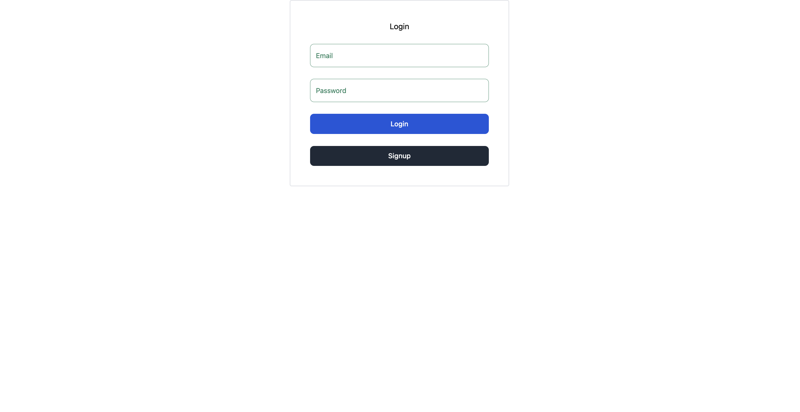
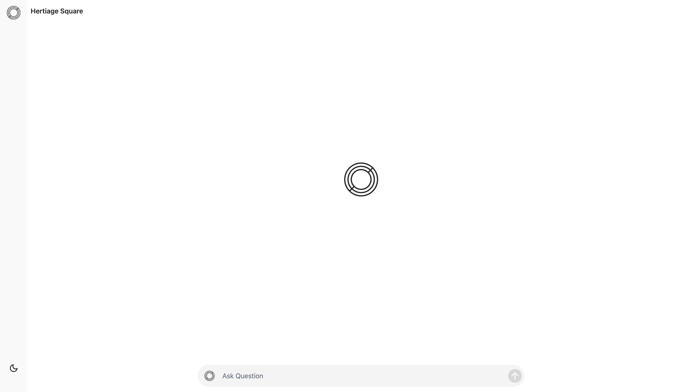

# 2024_fall Hackathon Project

## Quick Links
- [Hackathon Details](https://www.ohack.dev/hack/2024_fall)
- [Team Slack Channel](https://opportunity-hack.slack.com/app_redirect?channel=smiling_buddha)
- [Nonprofit Partner](https://ohack.dev/nonprofit/QFPGmii2GmDPYrv5tjHA)
- [Problem Statement](https://ohack.dev/project/Ti4BEIpXMsrPWvrE8WC8)

## Creator
@Ankur Narendrakumar Patel (on Slack)

## Team "smiling buddha"
- [Ankur Patel](https://github.com/ankur106)
- [Rakshilkumar Modi](https://github.com/rhmodi)

## Project Overview
`Project Overview`
An AI assistant designed to streamline document management for Heritage Square’s Google Drive. The AI retrieves, organizes, and tags documents, improving accuracy and saving time for staff involved in marketing, operations, and grants via giving ability to .

`Impact for Non-Profits`
The organization has thousands of files in Google Drive, making it difficult to find the correct file containing relevant information. Our solution provides a chatbot-like interface to interact with all the documents on Google Drive. It also adds links to the files at the bottom, allowing users to access more detailed information when needed.

## Features
1. Automated File Retrieval: Fetches documents from Google Drive using a Google service account.
2. Document Vectorization: Uses OpenAI to convert documents into vector embeddings for efficient querying.
3. Intelligent Querying: Responds to user queries by retrieving relevant documents based on vectorized content.





## Tech Stack
- Frontend:ReactJS, TailwindCSS, TypeScript
- Backend: Flask
- Database: QDrant Vector store
- Authentication: AWS Cognito User pool 
- APIs: OpenAI, AWS SDK, googleapis

## Future Improvements
1. File Categories based on high-level categories.
2. Implementation of reorganization and sorting features based on parameters like creation date.
3. Auto-sorting of images (historic vs non-historic).
4. Move Agent Implementation to Langgraph


## Getting Started
Instructions on how to set up and run your project locally.

```bash
# Example commands
git clone git@github.com:2024-Arizona-Opportunity-Hack/smiling-buddha-HeritageSquareFounda-HeritageSquareFoundationAIIntegrationChallenge.git
cd agent
python3 -m venv venv 
source /venv/bin/activate
pip3 install -r requirements.txt
python3 app.py

#IN another terminal
cd UI/Chat_UI
npm install
npm run dev
```

## Demo link

 Youttube Demo link:- [](https://youtu.be/2xsej_3-pMo?si=Ug7mv3WuusNPkNfX)


